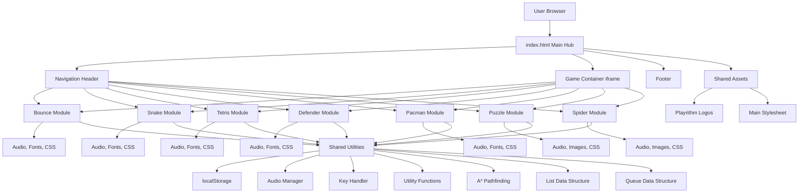
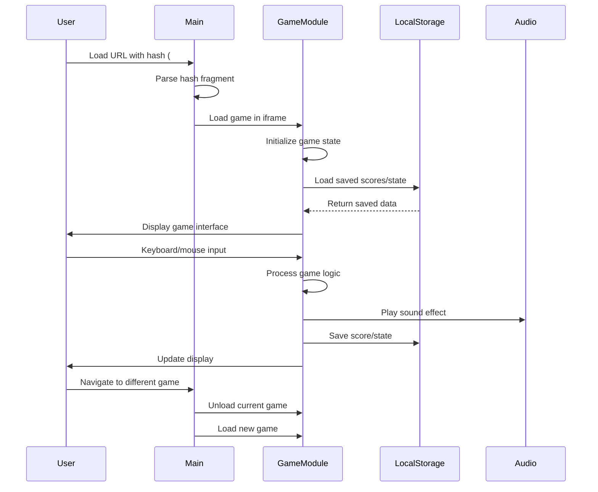
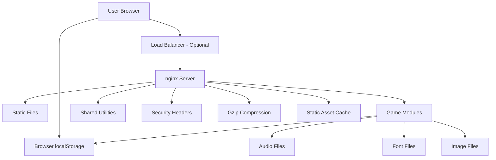

# Playrithm

Play free online browser games including Snake, Tetris, Bounce, Pacman, Spider Solitaire, Puzzle and Defender. No downloads. Play instantly on desktop and mobile.

---

## Product Type

Static Web-Based Gaming Platform

## Maintainer / Organization

**Maintainer**: Hardik Saxena (VAMP415)  
**Organization**: ThinkPixel  
**Website**: https://www.thinkpixel.org/

## Live URLs

- **Production**: https://playrithm.thinkpixel.org/
- **Organization**: https://www.thinkpixel.org/
- **Founder Portfolio**: https://hardik.thinkpixel.org/

## License

MIT License - Copyright (c) 2026 Hardik Saxena

## Tech Stack Badges


---

## Overview

Playrithm is a comprehensive browser-based gaming platform that hosts seven classic games, all built with vanilla JavaScript and designed for instant play without downloads. The platform features a modular architecture where each game operates as an independent module loaded via iframe navigation, ensuring clean separation and optimal performance.

## Target Users

- Casual gamers seeking quick entertainment
- Students and professionals looking for brief mental breaks
- Retro gaming enthusiasts
- Users with limited bandwidth (no large downloads required)
- Mobile and desktop users across all devices

## Problem Statement

Modern gaming often requires large downloads, account registrations, and powerful hardware. Many classic games are inaccessible to users who want instant entertainment without barriers.

## Solution Summary

Playrithm provides instant access to seven classic browser games through a single web interface. The platform uses:
- **Zero-dependency architecture**: Pure JavaScript ES6 modules
- **Client-side processing**: No server requirements for gameplay
- **Local storage persistence**: High scores and game states saved locally
- **Responsive design**: Works across desktop, tablet, and mobile devices
- **Docker deployment**: Simple containerized deployment for production

## Key Features

- **7 Classic Games**: Bounce, Snake, Tetris, Defender, Pacman, Puzzle, Spider Solitaire
- **Instant Play**: No downloads, registrations, or installations required
- **High Score System**: LocalStorage-based score tracking per game mode
- **Sound Effects**: Custom audio effects for each game
- **Keyboard Shortcuts**: Full keyboard control support
- **Pause/Resume**: Game state preservation during sessions
- **Multiple Difficulty Levels**: Various game modes and difficulty settings
- **Responsive Design**: Optimized for all screen sizes
- **SEO Optimized**: Structured data, sitemaps, and meta tags
- **PWA Ready**: Web manifest and mobile app capabilities

## Platform Modules

### Bounce
Classic brick-breaker game with three modes:
- **Speed Mode**: Ball accelerates with each hit
- **Random Mode**: Random ball angle changes
- **Bricks Mode**: Traditional brick-breaking with shrinking paddle

### Snake
Classic snake game with four difficulty levels:
- **Easy**: Slow speed, generous timing
- **Medium**: Balanced difficulty
- **Hard**: Fast speed, tight timing
- **Super**: Maximum challenge
- **Demo Mode**: AI demonstration on menu hover

### Tetris
Classic puzzle game with:
- **7 Tetriminos**: I, J, L, O, S, T, Z pieces
- **Ghost Piece**: Preview of piece placement
- **Level System**: Progressive difficulty
- **Next Piece Preview**: Strategic planning
- **Hard Drop**: Instant piece placement

### Defender
Tower defense game featuring:
- **10 Tower Types**: Shoot, Fast, Missile, AntiAir, Frost, Earthquake, Ink, Snap, Laser, Boost
- **Multiple Maps**: Varied terrain and path layouts
- **3 Difficulty Levels**: Easy, Normal, Hard
- **Wave System**: Progressive enemy waves
- **Tower Upgrades**: Level-based improvements

### Pacman
Classic maze game with:
- **4 Ghosts**: Blinky, Pinky, Inky, Clyde with unique AI behaviors
- **Power Pellets**: Temporary ghost vulnerability
- **Fruit Bonuses**: Score multipliers
- **Demo Mode**: AI gameplay demonstration
- **Multiple Levels**: Progressive difficulty

### Puzzle
Jigsaw puzzle game with:
- **5 Image Categories**: Animal, Apple, Art, Car, Nature
- **10 Images per Category**: 50 total puzzles
- **Custom Difficulty**: Adjustable piece counts
- **Preview Mode**: Reference image display
- **Timer & Scoring**: Completion tracking

### Spider Solitaire
Card game with:
- **3 Difficulty Modes**: 1 Suit, 2 Suits, 4 Suits
- **Undo/Redo**: Move history management
- **Hint System**: Suggested moves
- **Statistics Tracking**: Win/loss ratios, streaks
- **Custom Card Graphics**: SVG-based card assets

---

## System Architecture

### Architecture Explanation

Playrithm follows a **modular iframe-based architecture** where each game operates as an independent module. The main `index.html` serves as a navigation hub that loads games into an iframe based on URL hash fragments. This design provides:

- **Isolation**: Each game's JavaScript and CSS are scoped to its iframe
- **Performance**: Only the active game's resources are loaded
- **Maintainability**: Games can be developed and updated independently
- **Security**: Isolated execution contexts prevent cross-game interference

### Architecture Diagram



### Data Flow Diagram



### Request Lifecycle

1. **Initial Load**: User accesses `https://playrithm.thinkpixel.org/`
2. **Hash Parsing**: JavaScript reads URL hash (e.g., `#snake`)
3. **Game Selection**: If no hash, defaults to `#bounce`
4. **Iframe Loading**: Selected game's `index.html` loaded into iframe
5. **Game Initialization**: Game module initializes with ES6 imports
6. **State Loading**: Game loads saved scores from localStorage
7. **Gameplay Loop**: `requestAnimationFrame` drives game loop
8. **State Persistence**: Scores and progress saved to localStorage
9. **Navigation**: User can switch games without page reload

---

## Technology Stack

### Frontend

- **HTML5**: Semantic markup, canvas elements for games
- **CSS3**: Styling, animations, responsive design
- **JavaScript (ES6+)**: 
  - ES6 Modules for code organization
  - `requestAnimationFrame` for game loops
  - Canvas API for rendering (Pacman)
  - DOM manipulation for UI
- **No Frameworks**: Pure vanilla JavaScript for maximum performance

### Backend

- **None**: Client-side only architecture
- **Static Files**: Served directly by nginx

### Database

- **localStorage**: Browser-based storage for:
  - High scores per game/mode
  - Game state persistence
  - User preferences (sound settings)
  - Statistics (Spider Solitaire)

### Authentication

- **Not Implemented**: No user authentication system
- **Anonymous**: All gameplay is anonymous

### Infrastructure

- **Docker**: Containerization with nginx:1.27-alpine
- **nginx**: Web server with production configuration
- **Static Hosting**: Can be deployed to any static hosting service

### DevOps

- **Dockerfile**: Multi-stage container build
- **nginx.conf**: Production-ready configuration
- **.dockerignore**: Build optimization

### Monitoring

- **Not Implemented**: No monitoring solution currently deployed

### Security

- **nginx Security Headers**:
  - X-Frame-Options: SAMEORIGIN
  - X-Content-Type-Options: nosniff
  - Referrer-Policy: strict-origin-when-cross-origin
  - Permissions-Policy: camera=(), microphone=(), geolocation=()
- **Server Tokens Off**: nginx version hidden

---

## Design System

### Color System

**Main Theme**: Dark gaming aesthetic
- **Background**: `#282828` (dark gray with radial gradient)
- **Header Background**: `rgba(20, 20, 20, 0.8)` (semi-transparent dark)
- **Accent Color**: `#900` (dark red border)
- **Text Colors**:
  - Primary: `#ffffff` (white)
  - Secondary: `#BBB` (light gray)
  - Tertiary: `#999` (medium gray)
- **Footer Background**: `#333333` (dark gray)

### Typography

**Font Families**:
- **Main UI**: HelveticaNeue, Helvetica Neue, Helvetica, Arial, sans-serif
- **Game Headers**: Georgia, Times, Times New Roman, serif
- **Custom Fonts** (per game):
  - Bounce: GLSNECB
  - Snake: Bauhaus 93, Equilibrium
  - Tetris: Agency Bold, Agency Regular
  - Defender: Battle Beasts, Prolamina
  - Pacman: Whimsy TT
  - Puzzle: Esteban
  - Spider: Comfortaa

### Component Architecture

**Shared Components**:
- **Header**: Expandable navigation with game links
- **Iframe Container**: Game display area
- **Footer**: Branding and copyright
- **Audio Control**: Mute/unmute toggle with visual indicator

**Game-Specific Components**:
- **Board/Canvas**: Game rendering area
- **Score Display**: Real-time score updates
- **Message Overlays**: Menus, pause screens, game over dialogs
- **Control Panels**: Tower selection (Defender), puzzle pieces (Puzzle)

### Layout Principles

- **Full-Screen Gaming**: Games utilize available viewport
- **Responsive Design**: Adapts to screen size
- **Minimal UI**: Clean interface focused on gameplay
- **Consistent Navigation**: Same header across all games

---

## UI/UX Guidelines

### Accessibility

- **Semantic HTML**: Proper heading hierarchy
- **ARIA Labels**: Navigation and interactive elements
- **Keyboard Navigation**: Full keyboard control support
- **Focus Indicators**: Visual feedback for keyboard users
- **Color Contrast**: WCAG AA compliant text contrast

### Navigation

- **Hash-Based Routing**: URL fragments for game selection
- **Header Expansion**: Hover to reveal full navigation
- **Visual Feedback**: Selected game highlighting
- **Quick Switching**: Instant game switching without reload

### User Flows

**Game Selection Flow**:
1. User lands on main page
2. Header expands on hover
3. User clicks game name
4. Game loads in iframe
5. URL updates with hash

**Gameplay Flow**:
1. Game displays main menu
2. User selects difficulty/mode
3. Game initializes
4. User plays game
5. Game over/pause options
6. Score saved to localStorage

### Design Consistency

- **Uniform Header**: Same navigation across all games
- **Consistent Audio Controls**: Mute toggle in same position
- **Standard Dialogs**: Similar overlay styling
- **Unified Typography**: Consistent font usage patterns

---

## Responsiveness & Breakpoints

### Implemented Breakpoints

**Desktop**: Full viewport utilization
- **Minimum Width**: 1024px recommended
- **Full-Screen Games**: Games scale to available space

**Tablet**: Adaptive layout
- **Width Range**: 768px - 1023px
- **Touch Controls**: Enhanced touch targets

**Mobile**: Optimized for small screens
- **Width Range**: 320px - 767px
- **Portrait/Landscape**: Both orientations supported
- **Touch-First**: Larger interactive elements

**Large Desktop**: Enhanced experience
- **Width**: 1200px+
- **Maximum Width**: Content constrained to 1200px (footer)

### Responsive Strategies

- **Viewport Meta Tag**: `width=device-width, initial-scale=1`
- **Percentage-Based Layouts**: Fluid dimensions
- **CSS Transforms**: Scaling for different screen sizes
- **Touch Event Support**: Mouse and touch input handling

---

## Folder Structure

```
Playrithm-private/
├── assets/                          # Shared assets
│   ├── playrithm-full-logo.png     # Main logo (1200x630)
│   └── playrithm-half-logo.png     # Icon/logo (180x180)
├── bounce/                          # Bounce game module
│   ├── audio/                       # Sound effects
│   │   ├── bounce.mp3
│   │   ├── brick.mp3
│   │   └── end.mp3
│   ├── design/                      # Game-specific CSS
│   │   └── style.css
│   ├── fonts/                       # Custom fonts
│   │   └── glsnecb.ttf
│   ├── source/                      # JavaScript modules
│   │   ├── Ball.js                  # Ball physics
│   │   ├── Board.js                # Game board
│   │   ├── Brick.js                # Individual brick
│   │   ├── Bricks.js               # Brick management
│   │   ├── Display.js              # UI display controller
│   │   ├── HighScores.js           # Score management
│   │   ├── Keyboard.js            # Input handling
│   │   ├── Main.js                 # Game entry point
│   │   ├── Mode.js                 # Game modes
│   │   ├── Score.js                # Score tracking
│   │   ├── Ship.js                 # Player paddle
│   │   └── Tail.js                 # Ball trail effect
│   ├── cache.manifest              # Offline cache
│   └── index.html                  # Game HTML
├── defender/                        # Defender tower defense game
│   ├── audio/                       # Sound effects (17 files)
│   ├── design/                      # CSS files
│   │   ├── design.css
│   │   ├── mobs.css
│   │   ├── sidebar.css
│   │   └── towers.css
│   ├── fonts/                       # Custom fonts
│   │   ├── battlebeasts.ttf
│   │   └── prolamina.ttf
│   ├── source/                      # JavaScript modules
│   │   ├── ammo/                   # Tower ammunition types
│   │   │   ├── Ammo.js
│   │   │   ├── AntiAirAmmo.js
│   │   │   ├── EarthquakeAmmo.js
│   │   │   ├── FastAmmo.js
│   │   │   ├── FrostAmmo.js
│   │   │   ├── InkAmmo.js
│   │   │   ├── LaserAmmo.js
│   │   │   ├── MissileAmmo.js
│   │   │   ├── ShootAmmo.js
│   │   │   └── SnapAmmo.js
│   │   ├── maps/                   # Game maps
│   │   │   ├── Map.js
│   │   │   ├── Maps.js
│   │   │   └── Wall.js
│   │   ├── mob/                    # Enemy types
│   │   │   ├── Mob.js
│   │   │   └── Mobs.js
│   │   ├── tower/                  # Tower types
│   │   │   ├── Tower.js
│   │   │   └── Towers.js
│   │   ├── Board.js                # Game board
│   │   ├── Data.js                 # Game data
│   │   ├── Display.js              # UI display
│   │   ├── Factory.js              # Object factory
│   │   ├── Main.js                 # Game entry point
│   │   ├── Panel.js                # UI panels
│   │   └── Score.js                # Score tracking
│   └── index.html                  # Game HTML
├── pacman/                          # Pacman game module
│   ├── audio/                       # Sound effects
│   ├── design/                      # Game CSS
│   │   └── style.css
│   ├── fonts/                       # Custom fonts
│   │   └── whimsytt.ttf
│   ├── source/                      # JavaScript modules
│   │   ├── animations/             # Game animations
│   │   │   ├── Animation.js
│   │   │   ├── Animations.js
│   │   │   ├── DeathAnimation.js
│   │   │   ├── EndLevelAnimation.js
│   │   │   ├── FruitScoreAnimation.js
│   │   │   ├── GameOverAnimation.js
│   │   │   ├── GhostScoreAnimation.js
│   │   │   ├── NewLevelAnimation.js
│   │   │   ├── PausedAnimation.js
│   │   │   └── ReadyAnimation.js
│   │   ├── board/                   # Board rendering
│   │   │   ├── Board.js
│   │   │   ├── BoardCanvas.js
│   │   │   ├── Canvas.js
│   │   │   ├── GameCanvas.js
│   │   │   └── Level.js
│   │   ├── demo/                    # AI demo system
│   │   │   ├── BigBlob.js
│   │   │   ├── Demo.js
│   │   │   ├── DemoBlob.js
│   │   │   ├── DemoData.js
│   │   │   ├── DemoFood.js
│   │   │   └── DemoGhost.js
│   │   ├── ghosts/                  # Ghost AI
│   │   │   ├── Blinky.js
│   │   │   ├── Clyde.js
│   │   │   ├── Ghost.js
│   │   │   ├── Ghosts.js
│   │   │   ├── Inky.js
│   │   │   └── Pinky.js
│   │   ├── score/                   # Score display
│   │   │   ├── Score.js
│   │   │   └── Scores.js
│   │   ├── Blob.js                 # Player character
│   │   ├── Display.js              # UI display
│   │   ├── Food.js                 # Pellets
│   │   ├── Fruit.js                # Power-ups
│   │   ├── HighScores.js           # Score management
│   │   └── Main.js                 # Game entry point
│   └── index.html                  # Game HTML
├── puzzle/                          # Puzzle game module
│   ├── audio/                       # Sound effects
│   ├── design/                      # Game CSS
│   │   └── style.css
│   ├── fonts/                       # Custom fonts
│   │   └── esteban.ttf
│   ├── images/                      # Puzzle images
│   │   ├── animal/                 # Animal category (10 images)
│   │   ├── apple/                  # Apple category (10 images)
│   │   ├── art/                    # Art category (10 images)
│   │   ├── car/                    # Car category (10 images)
│   │   └── nature/                 # Nature category (10 images)
│   ├── source/                      # JavaScript modules
│   │   ├── Board.js                # Game board
│   │   ├── Display.js              # UI display
│   │   ├── HighScores.js           # Score management
│   │   ├── Keyboard.js            # Input handling
│   │   ├── Main.js                 # Game entry point
│   │   ├── Piece.js                # Puzzle pieces
│   │   └── Pieces.js               # Piece management
│   └── index.html                  # Game HTML
├── snake/                           # Snake game module
│   ├── audio/                       # Sound effects
│   │   ├── eat.mp3
│   │   ├── end.mp3
│   │   └── start.mp3
│   ├── design/                      # Game CSS
│   │   └── style.css
│   ├── fonts/                       # Custom fonts
│   │   ├── bauhs93.ttf
│   │   └── equilibrium.ttf
│   ├── source/                      # JavaScript modules
│   │   ├── Board.js                # Game board
│   │   ├── Demo.js                 # AI demo
│   │   ├── Display.js              # UI display
│   │   ├── Food.js                 # Food items
│   │   ├── Game.js                 # Game logic
│   │   ├── HighScores.js           # Score management
│   │   ├── Instance.js             # Game instance
│   │   ├── Keyboard.js            # Input handling
│   │   ├── Main.js                 # Game entry point
│   │   ├── Matrix.js               # Grid management
│   │   ├── Score.js                # Score tracking
│   │   └── Snake.js                # Snake entity
│   ├── cache.manifest              # Offline cache
│   └── index.html                  # Game HTML
├── spider/                          # Spider Solitaire game
│   ├── audio/                       # Sound effects
│   ├── design/                      # Game CSS
│   │   └── style.css
│   ├── fonts/                       # Custom fonts
│   │   └── comfortaa.ttf
│   ├── images/                      # Card assets (SVG)
│   │   ├── 1B.svg through KS.svg  # All 52 cards
│   ├── source/                      # JavaScript modules
│   │   ├── Board.js                # Game board
│   │   ├── Card.js                 # Card entity
│   │   ├── Cards.js                # Card management
│   │   ├── Column.js               # Tableau columns
│   │   ├── Columns.js              # Column management
│   │   ├── Display.js              # UI display
│   │   ├── Game.js                 # Game logic
│   │   ├── HighScores.js           # Score management
│   │   ├── Keyboard.js            # Input handling
│   │   ├── Main.js                 # Game entry point
│   │   ├── Score.js                # Score tracking
│   │   ├── Stock.js                # Stock pile
│   │   └── Tableau.js              # Tableau management
│   └── index.html                  # Game HTML
├── tetris/                          # Tetris game module
│   ├── audio/                       # Sound effects
│   │   ├── crash.mp3
│   │   ├── drop.mp3
│   │   ├── end.mp3
│   │   ├── line.mp3
│   │   ├── pause.mp3
│   │   └── rotate.mp3
│   ├── design/                      # Game CSS
│   │   └── style.css
│   ├── fonts/                       # Custom fonts
│   │   ├── agencyb.ttf
│   │   └── agencyr.ttf
│   ├── source/                      # JavaScript modules
│   │   ├── Board.js                # Game board
│   │   ├── Display.js              # UI display
│   │   ├── HighScores.js           # Score management
│   │   ├── Keyboard.js            # Input handling
│   │   ├── Level.js                # Level system
│   │   ├── Main.js                 # Game entry point
│   │   ├── Score.js                # Score tracking
│   │   ├── Tetrimino.js            # Individual piece
│   │   └── Tetriminos.js           # All tetriminos
│   ├── cache.manifest              # Offline cache
│   └── index.html                  # Game HTML
├── utils/                           # Shared utilities
│   ├── AStar.js                    # A* pathfinding algorithm
│   ├── KeyCode.js                  # Keyboard code handling
│   ├── List.js                     # Linked list data structure
│   ├── Queue.js                    # Queue data structure
│   ├── Sounds.js                   # Audio management
│   ├── Storage.js                  # localStorage wrapper
│   └── Utils.js                    # Utility functions
├── .dockerignore                    # Docker build exclusions
├── .gitattributes                   # Git configuration
├── Dockerfile                       # Docker container definition
├── LICENSE                          # MIT License
├── nginx.conf                       # nginx configuration
├── index.html                       # Main entry point
├── README.md                        # This file
├── robots.txt                       # SEO robots file
├── site.webmanifest                 # PWA manifest
├── sitemap.xml                      # SEO sitemap
└── style.css                        # Main stylesheet
```

### Purpose & Ownership

- **assets/**: Shared branding assets - Global
- **bounce/**: Bounce game module - Independent
- **defender/**: Tower defense game - Independent
- **pacman/**: Pacman game module - Independent
- **puzzle/**: Jigsaw puzzle game - Independent
- **snake/**: Snake game module - Independent
- **spider/**: Spider Solitaire game - Independent
- **tetris/**: Tetris game module - Independent
- **utils/**: Shared JavaScript utilities - Global dependency

### Dependencies

- **Game Modules**: Depend on `utils/` for shared functionality
- **Main index.html**: No dependencies (pure HTML/JS)
- **Individual Games**: Self-contained with shared utils

---

## Environment Variables

**Not Applicable**: This project uses no environment variables. All configuration is handled through:
- nginx configuration files
- JavaScript constants within modules
- localStorage for user preferences

---

## Configuration Guide

### Runtime Configurations

**nginx Configuration** (`nginx.conf`):
- **Port**: 80 (configurable via Docker)
- **Root Directory**: `/usr/share/nginx/html`
- **Index File**: `index.html`
- **Charset**: UTF-8
- **Compression**: Gzip enabled (level 6)
- **Security Headers**: Pre-configured security headers

### Build Configurations

**Docker Configuration** (`Dockerfile`):
- **Base Image**: `nginx:1.27-alpine`
- **Copy Strategy**: All files copied to nginx html directory
- **Exposed Port**: 80
- **Default Command**: `nginx -g daemon off;`

### Environment Configurations

**Development**: Direct file opening or local server
**Production**: Docker container with nginx

### Feature Flags

**Not Implemented**: No feature flag system. All features are always available.

---

## Local Setup

### Prerequisites

- Modern web browser (Chrome, Firefox, Safari, Edge)
- Local web server (optional, for testing)
- Docker (optional, for containerized testing)

### Installation Steps

1. **Clone Repository**:
   ```bash
   git clone https://github.com/Vamp415/Playrithm-private.git
   cd Playrithm-private
   ```

2. **Direct File Access** (Simplest):
   - Open `index.html` directly in a web browser
   - No build process required

3. **Local Server** (Recommended):
   ```bash
   # Using Python 3
   python -m http.server 8000
   
   # Using Node.js http-server
   npx http-server -p 8000
   
   # Using PHP
   php -S localhost:8000
   ```
   - Navigate to `http://localhost:8000`

4. **Docker Setup** (Production-like):
   ```bash
   # Build Docker image
   docker build -t playrithm .
   
   # Run container
   docker run -p 8080:80 playrithm
   
   # Access at http://localhost:8080
   ```

### Verification

- Open browser to the configured URL
- Verify all 7 games are accessible via navigation
- Test game functionality (play, pause, score saving)
- Check audio playback
- Verify responsive design on different screen sizes

---

## Development Workflow

### Branching Strategy

**Not Implemented**: No formal branching strategy detected. Project appears to use direct main branch development.

### Coding Flow

1. **Game Development**: Each game in its own directory
2. **Module System**: ES6 imports for code organization
3. **Shared Code**: Common utilities in `utils/` directory
4. **Testing**: Manual browser testing

### Testing Flow

**Not Implemented**: No automated testing system. Manual testing required:
- Load each game module
- Test all game modes
- Verify score persistence
- Test keyboard/mouse controls
- Check responsive behavior

### Review Flow

**Not Implemented**: No formal code review process detected.

---

## Build & Scripts

### Available Scripts

**No package.json detected** - No npm scripts available.

### Manual Build Process

**Docker Build**:
```bash
docker build -t playrithm .
```

**Docker Run**:
```bash
docker run -p 8080:80 playrithm
```

### Script Reference Table

| Operation | Command | Description |
|-----------|---------|-------------|
| Build Docker Image | `docker build -t playrithm .` | Create Docker container |
| Run Container | `docker run -p 8080:80 playrithm` | Start nginx server |
| Local Server | `python -m http.server 8000` | Simple HTTP server |
| Open Directly | Open `index.html` | No server required |

---

## API Documentation

**Not Applicable**: This is a static website with no backend API. All functionality is client-side JavaScript.

---

## Database Schema

**Not Applicable**: No traditional database. Uses browser localStorage for data persistence.

### localStorage Schema

**High Scores Structure**:
```javascript
{
  "gameName.mode": [
    { "name": "Player", "score": 1000, "date": "2026-01-01" }
  ]
}
```

**Sound Settings**:
```javascript
{
  "gameName.sound": 0  // 0 = unmuted, 1 = muted
}
```

**Game State** (Snake):
```javascript
{
  "snake.instance": {
    "level": 1,
    "score": 500,
    "snake": [...],
    "food": {...}
  }
}
```

**Statistics** (Spider):
```javascript
{
  "spider.stats": {
    "won": 10,
    "lost": 5,
    "winningStreak": 3,
    "losingStreak": 2,
    "currentStreak": 1,
    "bestScore": 500,
    "bestTime": 120,
    "bestMoves": 50
  }
}
```

---

## Authentication Flow

**Not Implemented**: No authentication system. All gameplay is anonymous.

---

## Authorization & Roles

**Not Implemented**: No user roles or authorization system.

---

## Security Practices

### Authentication

**Not Applicable**: No authentication system.

### Authorization

**Not Applicable**: No authorization system.

### Secrets Handling

**Not Applicable**: No secrets or API keys used.

### Rate Limiting

**Not Implemented**: No rate limiting (static site).

### Validation

- **Input Validation**: Keyboard input validated via KeyCode utility
- **Score Validation**: Basic type checking for score values
- **localStorage Validation**: Error handling for storage operations

### XSS Protection

- **No User Input**: No user-generated content stored
- **Static Content**: All content is static HTML/JS
- **No eval()**: No dynamic code execution

### CSRF Protection

**Not Applicable**: No forms or state-changing requests.

### Secure Headers

**nginx Configuration**:
```nginx
add_header X-Frame-Options "SAMEORIGIN" always;
add_header X-Content-Type-Options "nosniff" always;
add_header Referrer-Policy "strict-origin-when-cross-origin" always;
add_header Permissions-Policy "camera=(), microphone=(), geolocation=()" always;
```

---

## Compliance & Data Privacy

**Not Implemented**: No compliance features implemented.

### Data Collection

- **No Analytics**: No user tracking or analytics
- **No Cookies**: No cookie usage
- **Local Storage Only**: All data stored locally on user's device

### Data Retention

- **User-Controlled**: Users can clear localStorage
- **No Server Storage**: No data stored on servers

### User Consent

**Not Applicable**: No data collection requiring consent.

---

## Deployment Guide

### Production Deployment

#### Docker Deployment (Recommended)

1. **Build Image**:
   ```bash
   docker build -t playrithm:latest .
   ```

2. **Run Container**:
   ```bash
   docker run -d -p 80:80 --name playrithm playrithm:latest
   ```

3. **Behind Reverse Proxy** (Optional):
   ```nginx
   server {
       server_name playrithm.example.com;
       
       location / {
           proxy_pass http://localhost:8080;
           proxy_set_header Host $host;
           proxy_set_header X-Real-IP $remote_addr;
       }
   }
   ```

#### Static Hosting Deployment

1. **Upload Files**: Upload all files to static hosting service
2. **Configure Server**: Ensure server serves `index.html` for root
3. **Enable Compression**: Enable gzip compression
4. **Set Cache Headers**: Configure static asset caching

### Deployment Checklist

- [ ] Build Docker image
- [ ] Test container locally
- [ ] Configure DNS records
- [ ] Set up SSL/TLS certificates
- [ ] Configure reverse proxy (if needed)
- [ ] Test all games in production
- [ ] Verify localStorage persistence
- [ ] Check mobile responsiveness
- [ ] Test audio playback
- [ ] Verify SEO meta tags

---

## Hosting Architecture

### Servers

- **Web Server**: nginx 1.27-alpine
- **Application Server**: None (static files)
- **Database Server**: None (localStorage)

### Reverse Proxy

**Optional**: Can be deployed behind reverse proxy for:
- SSL/TLS termination
- Domain routing
- Additional security headers
- Load balancing

### CDN

**Not Implemented**: No CDN integration. Can be added for:
- Asset distribution
- Geographic distribution
- DDoS protection

### Storage

- **Static Files**: Served from nginx container
- **User Data**: Stored in browser localStorage
- **No Server-Side Storage**: No persistent server storage

### Infrastructure Diagram



---

## CI/CD Pipeline

**Not Implemented**: No CI/CD pipeline detected.

### Recommended Future Implementation

**GitHub Actions Example**:
```yaml
name: Deploy Playrithm

on:
  push:
    branches: [ main ]

jobs:
  deploy:
    runs-on: ubuntu-latest
    steps:
      - uses: actions/checkout@v2
      - name: Build Docker Image
        run: docker build -t playrithm .
      - name: Deploy to Registry
        run: docker push ...
      - name: Deploy to Server
        run: ...
```

---

## Performance Optimization

### Lazy Loading

**Not Implemented**: All games load immediately on selection.

### Code Splitting

**Implemented**: Each game is a separate ES6 module loaded only when needed via iframe.

### Caching

**nginx Configuration**:
- **Static Assets**: 30-day cache (CSS, JS, images, audio)
- **HTML Files**: No cache (always fresh)
- **Cache-Control**: `public, immutable` for static assets

### Asset Optimization

- **Gzip Compression**: Enabled for text-based assets
- **Image Optimization**: PNG format with appropriate dimensions
- **Audio Compression**: MP3 format for sound effects
- **Font Subsetting**: Custom fonts per game (not full font families)

### Performance Strategies

- **requestAnimationFrame**: Optimized game loops
- **localStorage**: Fast local data access
- **Minimal Dependencies**: No external libraries
- **ES6 Modules**: Native browser module loading

---

## Monitoring & Logging

**Not Implemented**: No monitoring or logging system currently deployed.

### Recommended Future Implementation

- **Error Tracking**: Sentry or similar for JavaScript errors
- **Performance Monitoring**: Web Vitals tracking
- **Analytics**: User engagement metrics (with consent)
- **Uptime Monitoring**: External service for availability

---

## Error Handling Strategy

### Frontend Errors

**JavaScript Errors**:
- Try-catch blocks in critical functions
- Graceful degradation for non-critical features
- Console logging for debugging

**localStorage Errors**:
- Fallback to memory storage if localStorage unavailable
- Error messages for quota exceeded
- Silent failure for non-critical storage

### Backend Errors

**Not Applicable**: No backend.

### API Errors

**Not Applicable**: No API calls.

### Error Recovery

- **Game Crashes**: Return to main menu
- **Storage Failures**: Continue without persistence
- **Audio Failures**: Continue without sound
- **Network Failures**: Offline-first design (cache.manifest)

---

## Roadmap

### Current Status

- ✅ 7 Classic Games Implemented
- ✅ Docker Deployment
- ✅ nginx Configuration
- ✅ Responsive Design
- ✅ localStorage Persistence
- ✅ SEO Optimization

### Future Scope

**Short Term**:
- [ ] Add more game modes to existing games
- [ ] Implement touch controls for mobile
- [ ] Add more puzzle images
- [ ] Improve accessibility features

**Medium Term**:
- [ ] Implement CI/CD pipeline
- [ ] Add error tracking (Sentry)
- [ ] Implement analytics (with consent)
- [ ] Add user accounts (optional)
- [ ] Cloud save synchronization

**Long Term**:
- [ ] Multiplayer features
- [ ] Tournament mode
- [ ] Leaderboards (server-side)
- [ ] Mobile app (React Native/Capacitor)
- [ ] Additional classic games

---

## Changelog

### Version 1.0.0 (Current)

**Initial Release**:
- 7 Classic Games (Bounce, Snake, Tetris, Defender, Pacman, Puzzle, Spider)
- Docker deployment configuration
- nginx production configuration
- Responsive design implementation
- localStorage-based high scores
- SEO optimization (meta tags, sitemap, structured data)
- PWA manifest
- Security headers configuration

---

## Contribution Guidelines

### Pull Requests

**Not Currently Accepting**: This is a personal project. Contact maintainer for contribution opportunities.

### Commit Standards

**Not Defined**: No formal commit message standards detected.

### Branch Naming

**Not Implemented**: Single branch development.

---

## Code Standards

### Naming Conventions

- **Files**: PascalCase for classes (`Ball.js`, `Board.js`)
- **Variables**: camelCase (`score`, `gameState`)
- **Constants**: UPPER_CASE for constants (not widely used)
- **Functions**: camelCase (`moveBall()`, `startGame()`)
- **Classes**: PascalCase (`class Sounds`, `class Storage`)

### Architecture Conventions

- **ES6 Modules**: All JavaScript uses ES6 import/export
- **Class-Based**: Object-oriented design for game entities
- **Separation of Concerns**: UI, logic, and data separated
- **Utility Functions**: Shared code in `utils/` directory
- **Game Modules**: Each game is self-contained

### Best Practices

- **No External Dependencies**: Pure vanilla JavaScript
- **localStorage for Persistence**: Browser-based data storage
- **requestAnimationFrame**: Optimized game loops
- **Event Delegation**: Efficient event handling
- **CSS Transforms**: Hardware-accelerated animations
- **Semantic HTML**: Proper HTML5 structure

---

## License Details

### MIT License

Copyright (c) 2026 Hardik Saxena

Permission is hereby granted, free of charge, to any person obtaining a copy of this software and associated documentation files (the "Software"), to deal in the Software without restriction, including without limitation the rights to use, copy, modify, merge, publish, distribute, sublicense, and/or sell copies of the Software, and to permit persons to whom the Software is furnished to do so, subject to the following conditions:

The above copyright notice and this permission notice shall be included in all copies or substantial portions of the Software.

THE SOFTWARE IS PROVIDED "AS IS", WITHOUT WARRANTY OF ANY KIND, EXPRESS OR IMPLIED, INCLUDING BUT NOT LIMITED TO THE WARRANTIES OF MERCHANTABILITY, FITNESS FOR A PARTICULAR PURPOSE AND NONINFRINGEMENT. IN NO EVENT SHALL THE AUTHORS OR COPYRIGHT HOLDERS BE LIABLE FOR ANY CLAIM, DAMAGES OR OTHER LIABILITY, WHETHER IN AN ACTION OF CONTRACT, TORT OR OTHERWISE, ARISING FROM, OUT OF OR IN CONNECTION WITH THE SOFTWARE OR THE USE OR OTHER DEALINGS IN THE SOFTWARE.

---

## Credits & Maintainers

### Founder & Developer

**Hardik Saxena** (VAMP415)
- GitHub: https://github.com/Vamp415
- LinkedIn: https://www.linkedin.com/in/hardik-saxena-77b354271
- Portfolio: https://hardik.thinkpixel.org/

### Organization

**ThinkPixel**
- Website: https://www.thinkpixel.org/
- LinkedIn: https://www.linkedin.com/company/thinkpixeledu/
- Instagram: https://www.instagram.com/_think.pixel_/
- Telegram: https://t.me/thinkpixeledu
- YouTube: https://youtube.com/@thinkpixel-x9c

### Support

- Buy Me a Coffee: https://buymeacoffee.com/vamp415
- Topmate: https://topmate.io/hardik_saxena_001/
- Linktree: https://linktr.ee/think_pixel

---

## Disclaimer

This project is provided as-is for educational and entertainment purposes. The games are classic implementations and may not exactly replicate the original commercial versions. No warranty is provided for the functionality or performance of this software.

---

## Contact & Support

### General Inquiries

- **Email**: Contact via ThinkPixel website
- **Website**: https://www.thinkpixel.org/
- **GitHub Issues**: https://github.com/Vamp415/Playrithm-private/issues

### Social Media

- **Instagram**: https://www.instagram.com/_og.vamp_/
- **Twitter/X**: https://x.com/hardiks57184721
- **Discord**: https://discord.gg/NKj5jRrTjP
- **Facebook**: https://www.facebook.com/hardik.saxena.12327
- **Snapchat**: https://snapchat.com/t/uFZfqlnB

### Professional

- **LeetCode**: https://leetcode.com/u/vchs415/
- **Spotify**: https://open.spotify.com/user/31l62rpqwbbawz3xdq2bv37vnfma

---

## Branding Footer

© 2026 VAMP415. All rights reserved.  
Playrithm is a project by ThinkPixel.  
Built with vanilla JavaScript, HTML5, and CSS3.  
Containerized with Docker and nginx.

---

**Last Updated**: January 2026  
**Version**: 1.0.0  
**Documentation**: Enterprise-Grade
